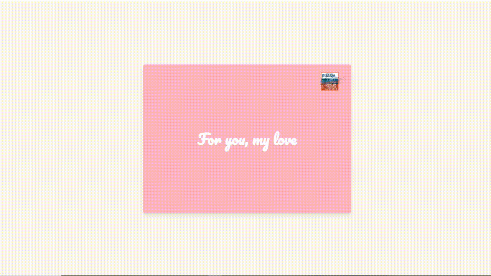

# 💕 Valentine's Day Postcard 💕

This repository contains an interactive **postcard** that opens up to reveal a heartfelt message. With this sweet card you can be sure you'll get your Valentine!



## Table of Contents
1. [Technologies Used](#-technologies-used)
2. [Installation](#-installation)
3. [Contributions](#-contributions)

## Technologies Used

- **React.js** ✨
- **Tailwind CSS** 🎨

## Installation

1. Clone the repository:

   ```bash
   git clone https://github.com/your-username/valentines-day-postcard.git
   ```
   
   ```bash
   npm install
   ```
   
   ```bash
   npm start
   ```
   
## 🤝 Contributions
I'm open to improvements and suggestions! If you have any ideas or want to contribute, feel free to open an issue or create a pull request. Let's spread the love together! 💖


Thanks for stopping by! 🤍
